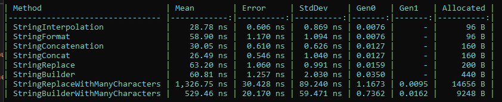

# Exemplo utilizando a bilioteca benchmark-dotnet
Exemplo com strings

Link para o repositório da biblioteca Benchmark:
https://github.com/dotnet/BenchmarkDotNet

Para os testes contendo um 'texto maior', o conteúdo foi retirado do site: https://www.ign.com/articles/1999/06/24/pokemon-red

À primeira vista o .Replace parece mais legível e fácil para algum desenvolver dar manutenção, mas como strings são imutáveis no .Net, ele acaba alocando mais memória pois "gera outras strings".

Recomendam o uso do StringBuilder para cenários onde há muitas strings para manipulação, visto na imagem que com pouco conteúdo o Replace acabou alocando menos memória que o StringBuilder, mas com um texto maior, inverteu o cenário.

Porém vai do bom-senso, a finalidade da sua aplicação, quantidade de acessos, quantidade de recurso disponível no servidor, etc.

